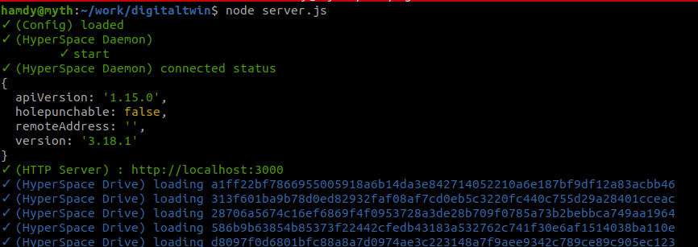
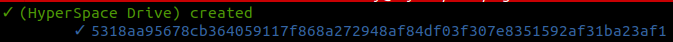

# DigitalTwin

- Install `yarn install` or `npm install`
- Run `node server.js`

# Tech overview

- When server starts
    - Starts http REST API server
    - Loads all (drives) in `db/drives.js` json file

        

- **REST Interface**
    - `POST /drive` create new drive
        - Body (JSON):: `{"name": "drive1"}`
        - Result :: `{"key": "5318aa95678cb364059117f868a272948af84df03f307e8351592af31ba23af1"`

            
    
    - `GET /drive/{id_orname}/{path}` List (for dirs) - Download (for files)
        - Result : `{"files": ["a.txt"]}`


# Testing
- Install hyp tools `npm install -g @hyperspace/cli`
- use the hyp command to check drives i.e `hyp ls hyper://5318aa95678cb364059117f868a272948af84df03f307e8351592af31ba23af1`


# wikis
- Run `node server.js`
- Add a drive `POST /drive` get the new drive key from result
- from publishing tools export wikis to file system (`~/generated`)
    ```
    cd publisher
    v publish.v
    ./publish export
    ```
- Install hyp cli tools `npm install -g @hyperspace/cli`
- sync wikis into newly created drive `hyp drive sync ~/generated/* hyper://{drive_id}/`
- Open wikis home page as a test `http://localhost:3000/drive/{drive_id}/wikis/`
- Choose a wiki to open or go directly to `http://localhost:3000/drive/{drive_id}/wikis/foundation#/`


# Packaging

using `pkg` tool 

- `npm install -g pkg`
- `./build.sh`


- PS : to find modules in your application with native prebuilds
    ```
    hamdy@myth:~/work/digitaltwin$ find . -name prebuilds
    ./node_modules/leveldown/prebuilds
    ./node_modules/utp-native/prebuilds
    ./node_modules/sodium-native/prebuilds
    ./node_modules/fd-lock/prebuilds
    ```


# dns

dig @127.0.0.1 -p5333 lsong.org


# ssl
npx greenlock add --subject new.threefold.io --altnames new.threefold.io